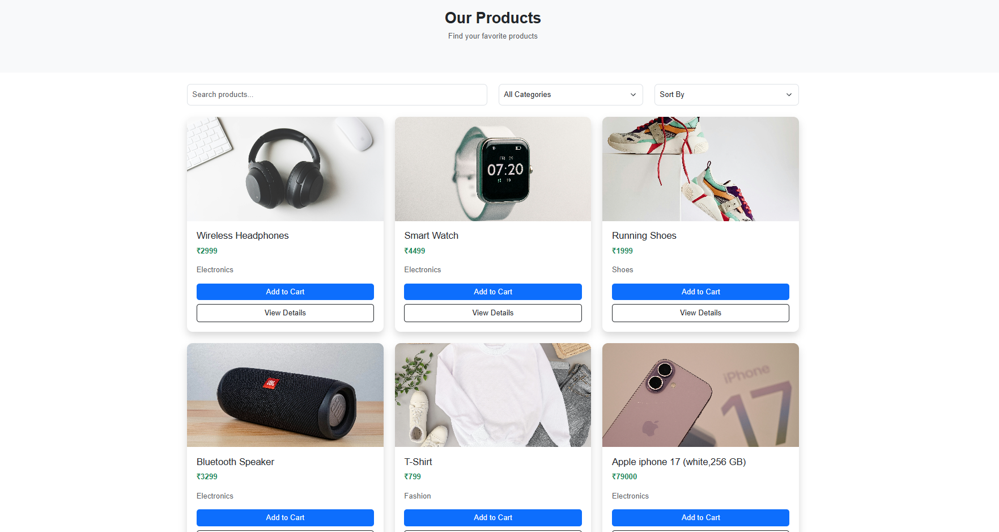
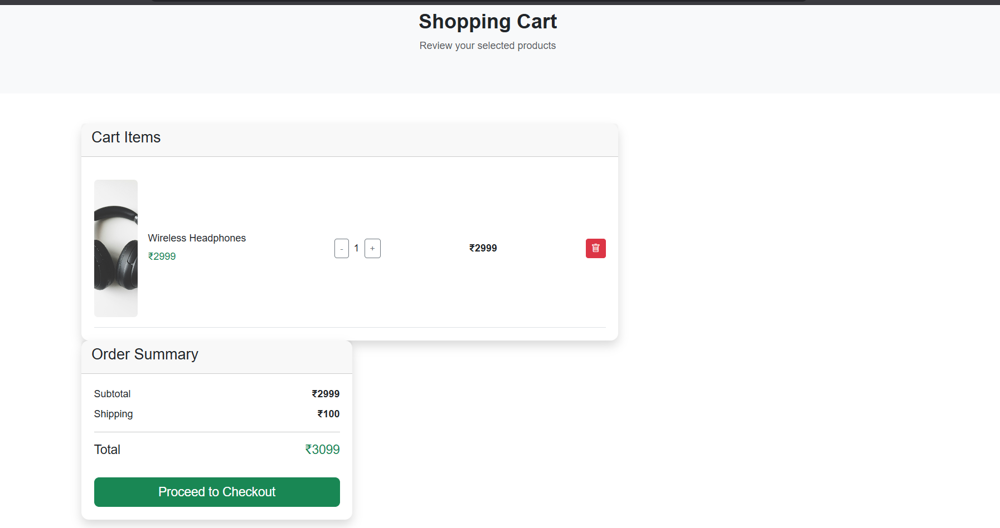
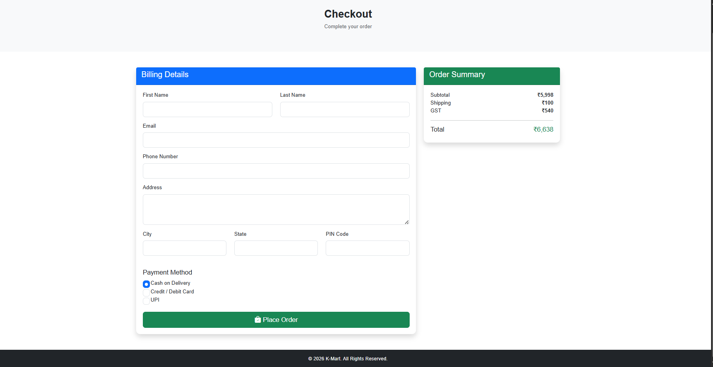
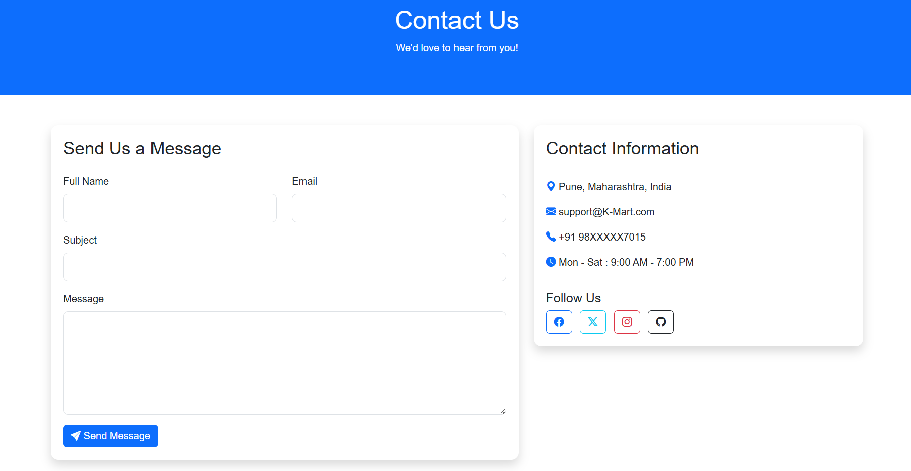
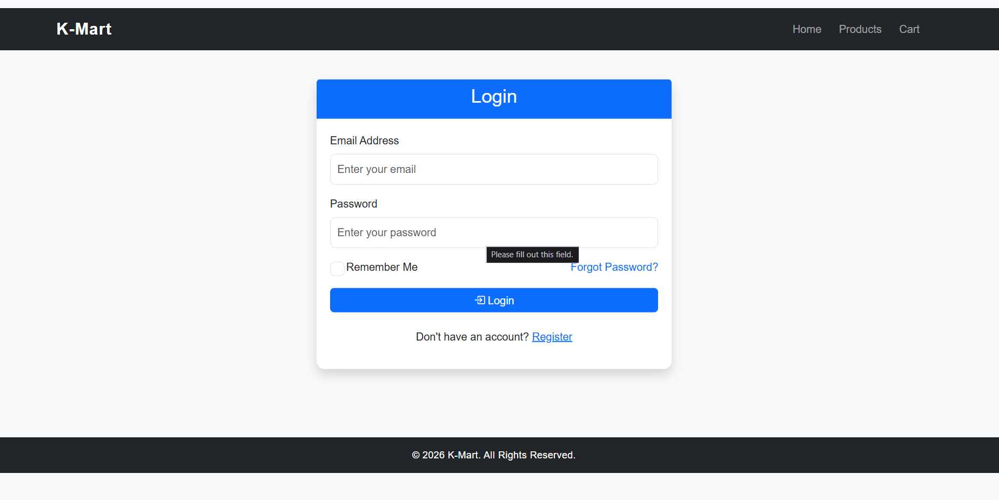

# 🛒 K-Mart - E-Commerce Website

> **Note:** This project is developed for educational and portfolio purposes only. It is not affiliated with or endorsed by the Kmart retail brand.

K-Mart is a responsive front-end e-commerce website built using **HTML, CSS, JavaScript, and Bootstrap**. It allows users to browse products, search items, add products to the shopping cart, and proceed to checkout through a clean and user-friendly interface.


## ✨ Features


- ✅ Responsive Design
- ✅ Product Listing
- ✅ Product Search
- ✅ Product Details Page
- ✅ Shopping Cart
- ✅ Add to Cart Functionality
- ✅ Remove from Cart
- ✅ Checkout Page
- ✅ User Login
- ✅ Contact Page
- ✅ Mobile-Friendly Interface
- ✅ Bootstrap-Based UI
## 🛠️ Tech Stack

- HTML5
- CSS3
- JavaScript (ES6)
- Bootstrap 5


##   📸 Screenshots







## 🗺️ Roadmap

- [ ] Add user registration and authentication
- [ ] Integrate a backend using Node.js and Express.js
- [ ] Connect a database (MongoDB or MySQL)
- [ ] Implement an online payment gateway
- [ ] Add a wishlist feature
- [ ] Enable product reviews and ratings
- [ ] Create an admin dashboard for product management
- [ ] Add order history and order tracking

## 📂 Project Structure

```text
E-commerce-website/
│
├── css/
│   ├── style.css
│   └── responsive.css
│
├── js/
│   ├── app.js
│   ├── cart.js
│   ├── products.js
│   └── search.js
│
├── images/
│   ├── banner.jpg
│   ├── product1.jpg
│   ├── ...
│   └── product9.jpg
│
├── cart.html
├── checkout.html
├── contact.html
├── index.html
├── login.html
├── product.html
├── products.html
│
└── README.md
```

## ⚙️ Installation

1. Clone the repository:

```bash
git clone https://github.com/KaushalAkuskar28/E-commerce-website.git
```

2. Navigate to the project folder:

```bash
cd E-commerce-website
```

3. Open the `index.html` file in your browser or run it using the **Live Server** extension in Visual Studio Code.
## ▶️ Usage

1. Open the `index.html` file in your web browser.
2. Browse the available products on the homepage or products page.
3. Use the search bar to quickly find products.
4. Click on a product to view its details.
5. Add products to the shopping cart.
6. Review and manage items in the cart.
7. Proceed to the checkout page to complete the purchase process.
8. Visit the login page to access your account interface.
9. Use the contact page to send inquiries or feedback.
## 👨‍💻 Author

**Akuskar Kaushal**

- GitHub: [@KaushalAkuskar28](https://github.com/KaushalAkuskar28)
- LinkedIn: [Kaushal Akuskar](https://www.linkedin.com/in/kaushal-akuskar)

##  📄 License

This project is developed for educational and portfolio purposes only.

The project is intended to demonstrate front-end web development skills using HTML, CSS, JavaScript, and Bootstrap.

